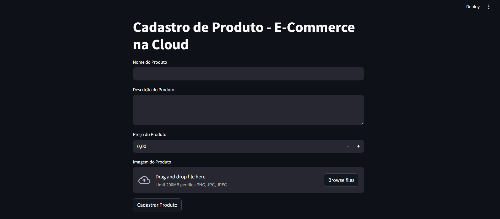

# E-commerce na cloud

<div align="center">
  
</div>


[](https://www.python.org/)


[](https://bitbucket.org/lbesson/ansi-colors)

# Descrição
Este projeto é um dos laboratórios do bootcamp Azure Cloud Native da DIO, com o objetivo de criar um e-commerce na cloud.

# Instruções de instalação
Este projeto não contemplará a parte de instruções de instalação. Como se trata de recursos provisionados em cloud, os mesmos foram desalocados para não gerar custos recorrentes. A aplicação será demonstrada através de prints.

# Informações técnicas
Para a realização deste projeto foram utilizados o Streamlit e o Azure (em duas frentes): </br>
## Azure Storage Account:
Utilizado para armazenar as imagens do e-commerce através de um blob container
## Azure SQL Database
Utilizado para a criação do banco de dados e da tabela que armazena as informações de input dos produtos cadastrados
## Streamlit
Roda a aplicação em Python de maneira interativa, com recursos orientados a dados e de visualização amigável.

# Tecnologias utilizadas

```Python 3.10.8```
```Streamlit```
```Azure Storage Account```
```Azure SQL Database```
```Azure Data Studio```


# Demonstração da aplicação




# Autora

[<br><sub>Jessica Oliveira</sub>](https://github.com/jessicaalines)


# Contato

Via LinkedIn:

* Jessica Oliveira: https://www.linkedin.com/in/jessica-aline-soares-oliveira/


---


Feito com sangue, suor e lágrimas 😅


